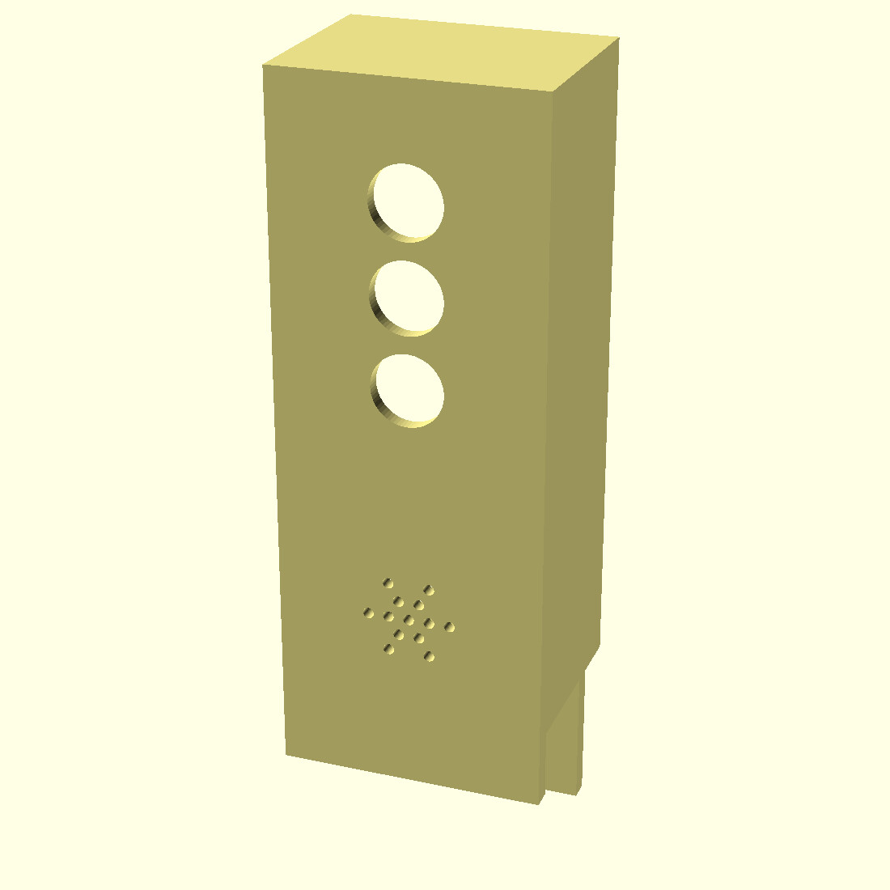
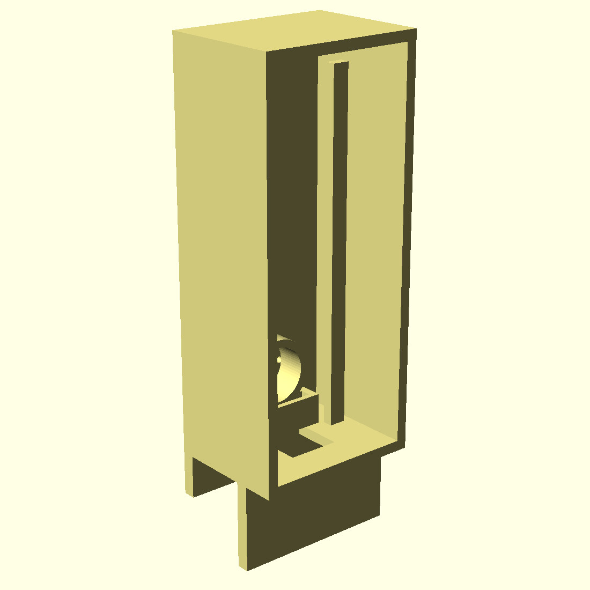
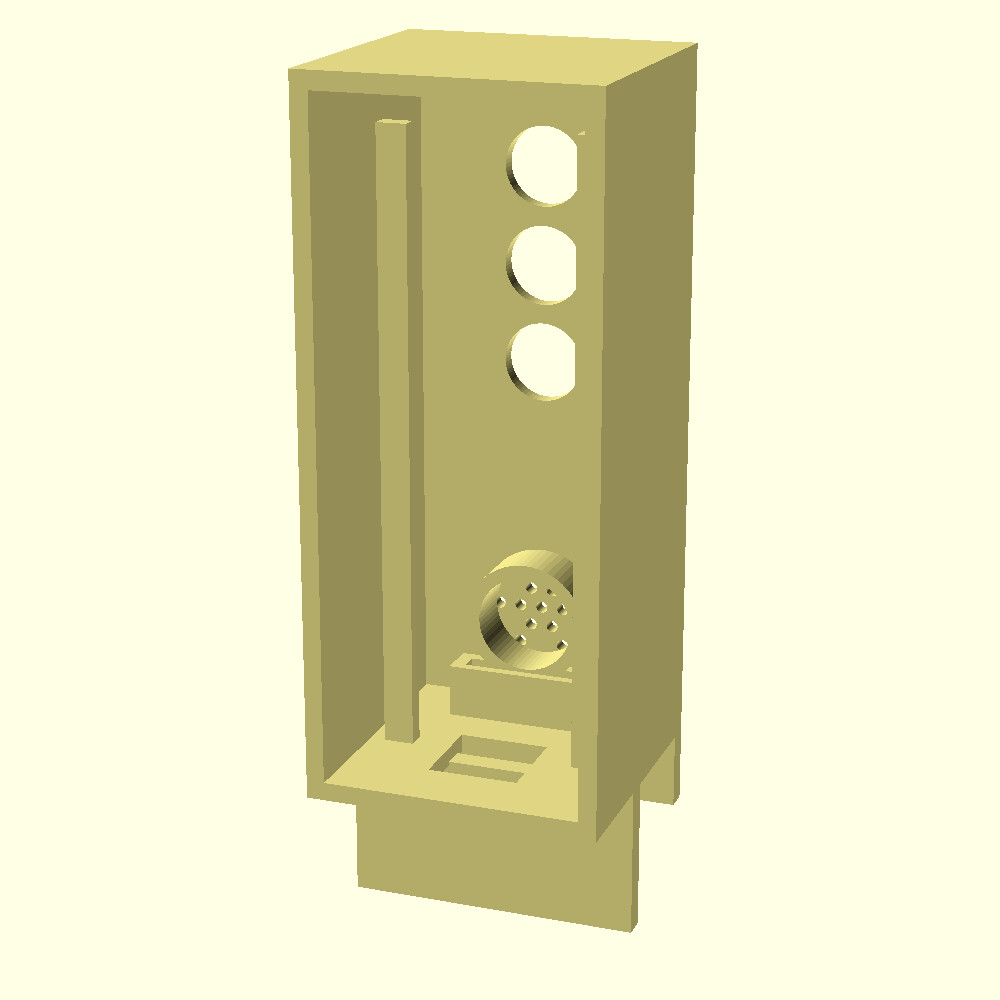
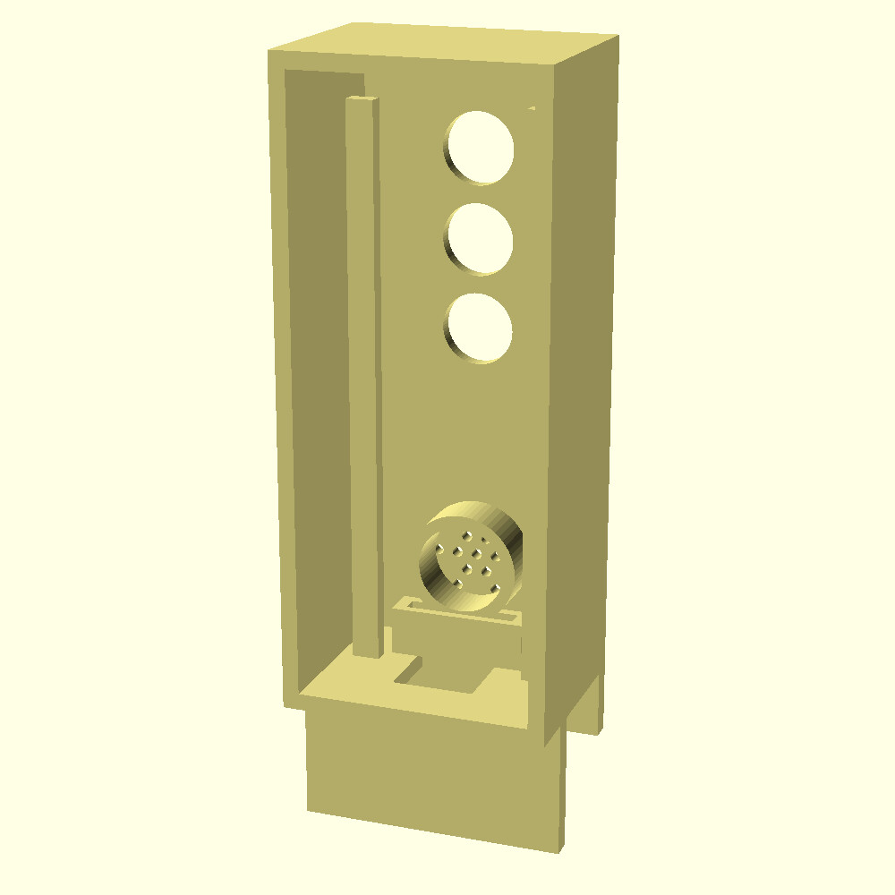

# Vibecoding Traffic Light 🚦

A physical traffic light hooked up to Claude Code.

- **Yellow blinking + beeps** → Claude needs your attention.
- **Red solid** → Claude is thinking.
- **Green solid** → Claude is done; keep coding.

<p align="center">
  
</p>

<p align="center">
  <a href="https://youtu.be/8MrP0tenx98">▶ Watch with audio</a>
</p>

---

## Hardware

- ESP32 DevKit
- Red LED → GPIO 25
- Yellow LED → GPIO 27
- Green LED → GPIO 26
- Passive buzzer → GPIO 33
- 220 Ω resistors for each LED

## Installation

1. Open `semaforo_server/semaforo_server.ino` in the Arduino IDE.
2. Set your WiFi credentials and a free static IP on your router:

```cpp
const char* SSID     = "YOUR_WIFI";   // change to your WiFi network
const char* PASSWORD = "YOUR_PASS";   // change to your WiFi password
IPAddress ip(192, 168, 1, 10);        // free static IP in your LAN range
```

3. Select the **ESP32 Dev Module** board and the correct serial port.
4. Upload the sketch (`Ctrl+U` / `Cmd+U`).
5. Open the Serial Monitor at 115200 baud and note the printed IP.

## Claude Configuration

The `claude-config.json` file contains the hooks so Claude can control the traffic light.

1. Copy its contents into your Claude Code configuration.
2. **Change the IP** (`192.168.1.10`) to the one your router assigned or the static one you configured.
3. Make sure your computer and the ESP32 are on the same network.

Web server endpoints:

| Endpoint          | Method | Effect                                       |
|-------------------|--------|----------------------------------------------|
| `/alerta`         | POST   | 2 beep bursts + yellow blinking for 30 s     |
| `/solo/amarillo`  | POST   | Same as `/alerta`                            |
| `/solo/rojo`      | POST   | Red solid + short beep                       |
| `/solo/verde`     | POST   | Green solid + "done" chime                   |
| `/off`            | POST   | Turn everything off                          |

## Claude Code Integration

Claude uses `curl` to talk to the traffic light at these moments:

- `Notification` → `/alerta` (Claude needs you)
- `UserPromptSubmit` → `/solo/rojo` (Claude is thinking)
- `Stop` → `/solo/verde` (Claude is done)

## Important: use a free static IP

The code uses `192.168.1.10` by default. Before using it:

1. Log into your router.
2. Check that `192.168.1.10` is not assigned to another device, or change it to a free IP in your range.
3. (Optional but recommended) Reserve that IP for your ESP32's MAC address in the router's DHCP settings.

## 3D Print Models

All files are in [`/models`](models/):

- `caja_base.stl` — main body.
- `caja_tapa.stl` — back cover.
- `caja_completa.scad` — parametric source.

The case has three holes for the LED module, a buzzer grille on the front, a clip to hang on the monitor bezel, an ESP32 bay with a USB-C slot at the back, and an internal cavity for soldered wires.

### Renders

<p align="center">
  
  
</p>

<p align="center">
  
  
</p>

### Things to check before printing

Open `caja_completa.scad` and adjust:

- `led_pitch` / `led_d` — spacing and diameter of your LED module.
- `mon_thick` — thickness of your monitor bezel (for the clip).
- `usb_y` / `usb_w` — position/width of the USB-C slot depending on how you mount the ESP32.

Export STLs:

```bash
openscad -D 'part="base"' -o caja_base.stl caja_completa.scad
openscad -D 'part="tapa"' -o caja_tapa.stl caja_completa.scad
```

## License

MIT

---

¿Hablas español? Encontrá la versión en castellano en [`README.es.md`](README.es.md).
